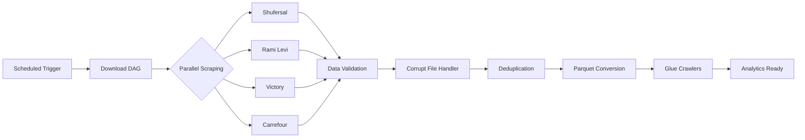

# 🛒 Israeli Supermarket Price Intelligence Platform

> **Real-time price & promotion data pipeline** processing thousands of daily records from major Israeli retail chains.

[](https://python.org)
[](https://airflow.apache.org)
[](https://aws.amazon.com)
[](https://docker.com)
[](https://elastic.co)

---

## 🎯 Project Overview

End-to-end **data engineering solution** that automates the collection, processing, and analysis of pricing data from Israel's largest supermarket chains. Built as a capstone project for the Data Engineering program at **Naya College**.

### Highlights

- Automated daily ingestion from 5 retail chains across 100+ branches
- Handles ~10,000 price records daily with data quality checks
- Fault-tolerant orchestration with exponential backoff retries
- Cloud-native: AWS S3, Glue crawlers, containerized services

---

## 🏗️ Architecture

```
┌──────────────────────────────────────────────────────────────────────────┐
│                              DATA SOURCES                                 │
│    Shufersal  •  Rami Levi  •  Victory  •  Carrefour  •  Hatzi Hinam     │
└─────────────────────────────────┬────────────────────────────────────────┘
                                  │ Web Scraping (Selenium + BeautifulSoup)
                                  ▼
┌──────────────────────────────────────────────────────────────────────────┐
│                         INGESTION LAYER                                   │
│  ┌─────────────┐    ┌─────────────┐    ┌─────────────┐                   │
│  │  Python     │    │   Apache    │    │   Docker    │                   │
│  │  Scrapers   │◄──►│   Airflow   │◄──►│  Containers │                   │
│  └─────────────┘    └─────────────┘    └─────────────┘                   │
└─────────────────────────────────┬────────────────────────────────────────┘
                                  │
                                  ▼
┌──────────────────────────────────────────────────────────────────────────┐
│                          STORAGE LAYER                                    │
│  ┌─────────────────────────────────────────────────────────────────┐     │
│  │                    Amazon S3 (Data Lake)                         │     │
│  │    Raw GZ Files  →  Parquet (Columnar)  →  Partitioned Tables   │     │
│  └─────────────────────────────────────────────────────────────────┘     │
└─────────────────────────────────┬────────────────────────────────────────┘
                                  │
                                  ▼
┌──────────────────────────────────────────────────────────────────────────┐
│                        PROCESSING LAYER                                   │
│  ┌─────────────┐    ┌─────────────┐    ┌─────────────┐                   │
│  │  AWS Glue   │    │   Apache    │    │  PostgreSQL │                   │
│  │  Crawlers   │    │   Spark     │    │             │                   │
│  └─────────────┘    └─────────────┘    └─────────────┘                   │
└─────────────────────────────────┬────────────────────────────────────────┘
                                  │
                                  ▼
┌──────────────────────────────────────────────────────────────────────────┐
│                       ANALYTICS LAYER                                     │
│  ┌─────────────────────────────────────────────────────────────────┐     │
│  │          Elasticsearch + Kibana (Search & Visualization)        │     │
│  └─────────────────────────────────────────────────────────────────┘     │
└──────────────────────────────────────────────────────────────────────────┘
```

---

## 🛠️ Tech Stack

| Category           | Technologies                              |
| ------------------ | ----------------------------------------- |
| **Orchestration**  | Apache Airflow (CeleryExecutor), Redis    |
| **Compute**        | Python 3.13, Apache Spark 3.4, Selenium   |
| **Storage**        | AWS S3, PostgreSQL, Hive Metastore        |
| **Processing**     | AWS Glue Crawlers, Parquet, ETL Pipelines |
| **Analytics**      | Elasticsearch 7.13, Kibana                |
| **Infrastructure** | Docker Compose (10 services), MariaDB     |

---

## 📁 Project Structure

```
├── docker-compose.yaml           # Full infrastructure definition
├── Chains.csv                    # Retail chain configuration
└── volumes/
    ├── Python_Scripts/
    │   ├── Sources/              # Web scrapers for each chain
    │   ├── aws_glue/             # Glue crawler jobs
    │   └── miscellaneous/        # Data quality utilities
    ├── airflow/airflow_data/
    │   └── dags/                 # Orchestration DAGs
    └── requirements/             # Python dependencies
```

---

## 🚀 Quick Start

```bash
# 1. Clone & configure
git clone https://github.com/your-username/NayaFinalProject.git
cd NayaFinalProject

# 2. Set environment variables
export AWS_ACCESS_KEY_ID="your-key"
export AWS_SECRET_ACCESS_KEY="your-secret"
export AWS_DEFAULT_REGION="us-east-1"

# 3. Launch infrastructure
docker-compose up -d

# 4. Access Airflow UI
open http://localhost:8080  # Credentials: airflow/airflow
```

---

## 📊 Data Pipeline Workflow



**DAG Features:**

- Parallel execution across chains
- Automatic retries with exponential backoff
- Cross-DAG triggering for modular workflows
- Comprehensive logging to S3

---

## 👥 Team

| Name                 | Role             |
| -------------------- | ---------------- |
| **Rotem Reich**      | Data Engineering |
| **Johnathan Malihi** | Data Engineering |

_Naya College — Data Engineering Program, 2025_

---

## License

Final project — Naya College Data Engineering.
